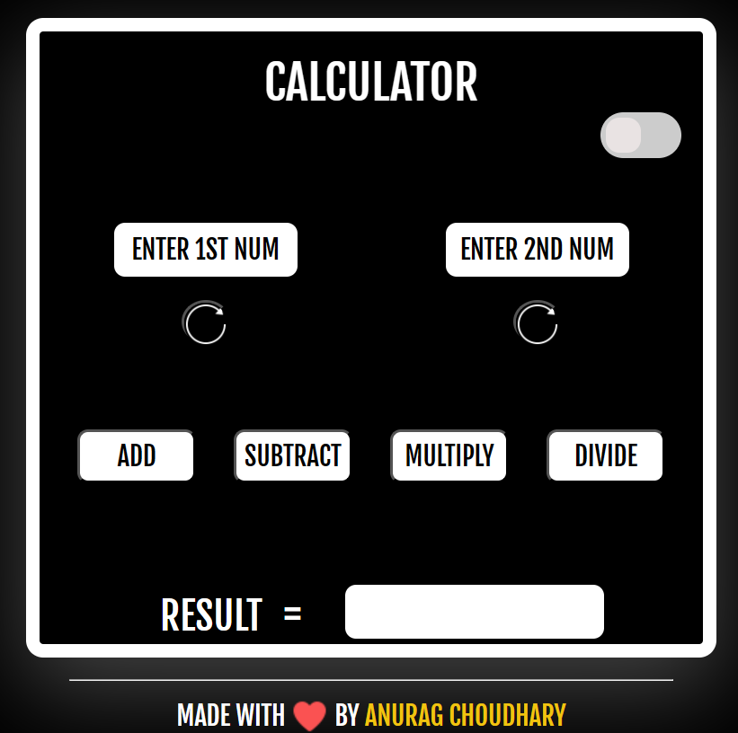

 🔢 MathSmith Calculator

MathSmith is a stylish and responsive web-based calculator that performs basic arithmetic operations. It features a sleek UI, dark mode toggle, and is built using HTML, CSS, and JavaScript.

---
👉 [Try it here](https://anuraga3s.github.io/MathSmith-Calculator/)  
## 🚀 Features

- ✅ Addition, Subtraction, Multiplication, Division
- 🌗 Light/Dark Mode toggle
- 🔁 Reload buttons to re-enter inputs
- 💬 Prompt-based input system
- 📱 Responsive design (mobile-friendly)
- 💖 Footer credit & clean aesthetic

---

## 📂 Project Structure

